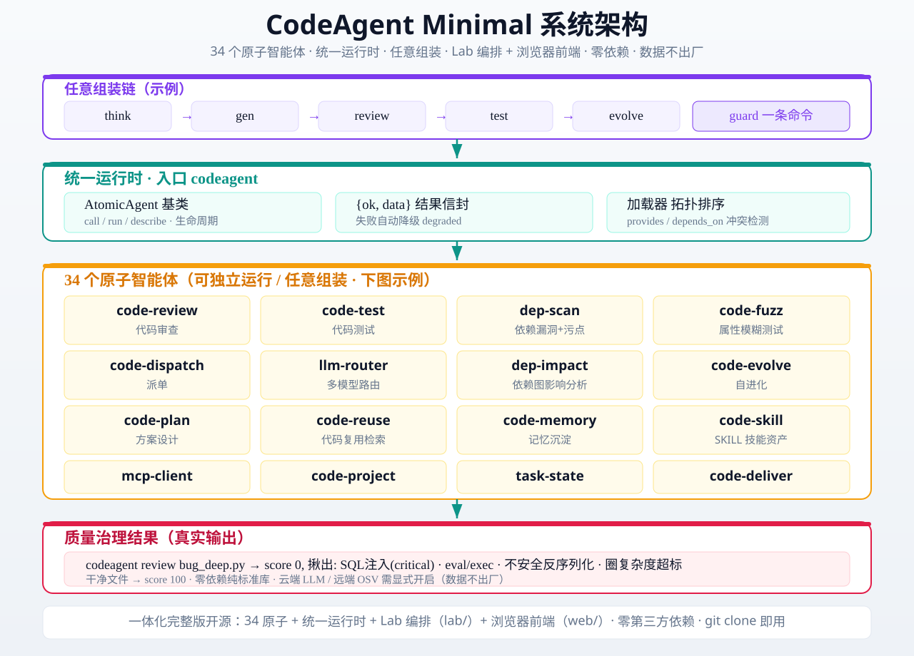

# CodeAgent Minimal — 原子化可组装代码质量治理 Agent

> ⭐ **觉得有用就给我们一个 Star** —— 你的 Star 让这个项目被更多人看见，支持我们持续迭代。
> [](https://github.com/zhengjinjun1975/codeagent-minimal)

> **v0.3.0 · 原子化重构** — 把代码审查 / 测试 / 依赖漏洞 / 变异 / 模糊 / 回归 / 自进化等能力拆成 **32 个可独立运行、可任意组装的原子智能体**，由统一运行时编排、统一入口 `codeagent` 驱动。
> **开源内核 + 闭源编排**：本仓库开源 32 原子 + 统一运行时/入口（Apache-2.0）；重型闭源编排（assembler / orchestrator / CodeMode）位于独立工作区，不随本仓库分发。

[](LICENSE)
[](CHANGELOG.md)
[](https://github.com/zhengjinjun1975/codeagent-minimal)
[](https://github.com/zhengjinjun1975/codeagent-minimal)

**它能帮你**：一键代码审查、自动化测试、依赖漏洞扫描、变异测试、模糊测试、回归验证——32 个原子智能体，任意组装，零第三方依赖，数据不出厂。

---

## 文档导航

| 文档 | 说明 |
|------|------|
| **[docs/PROMOTION.md](docs/PROMOTION.md)** | 开源宣传文案：场景痛点 / 方法论 / 诚实边界（为什么是「极简 + 本地 + 原子化」） |
| **[docs/CAPABILITY.md](docs/CAPABILITY.md)** | 能力域与优势：8 大能力域 + 5 大优势 + 定位一句话 |
| **[docs/ATOMS_GUIDE.md](docs/ATOMS_GUIDE.md)** | 32 原子逐个指南：能力 / 入参 / 返回信封 `{ok,data}` / 示例代码（真实信封核实），含独立运行 + 统一入口两种调用 |
| **[docs/INTEGRATION_GUIDE.md](docs/INTEGRATION_GUIDE.md)** | 对接传统框架（LangChain / CrewAI / AutoGen / OpenAI Agents SDK / Claude Code）：作为 Tool / 子代理节点 / 图编排 / REST / CLI 集成，边界为本地原子 + 数据不出厂 + 开源内核闭源编排 |
| **examples/** | 已跑通对接示例：`codeagent_toolkit.py`（统一接入层）、`langchain_integration.py`、`crewai_integration.py`、`graph_orchestration.py`（子代理节点+图编排）、`web_api_client.py`（REST） |
| **架构总览** |  |

> 用户可**独立使用**（读 ATOMS_GUIDE 直接用 32 原子）与**独立集成**（读 INTEGRATION_GUIDE + examples 接入任意框架），无需闭源编排参与。

---

## 定位

**给需要审代码但不写代码的人：本地极简代码审查 / 安全 / 测试智能体，纯标准库零依赖，数据不出厂，原子化可组装，中小企业工厂代码工具。**

- **原子化**：每个能力是一个「原子智能体」（`AtomicAgent` 基类），具备统一接口 `call / run / describe`、统一生命周期 `discovered → loaded → ready`、统一 `{ok, data}` 结果信封、失败自动降级 `{ok:false, degraded:true}`。
- **可组装**：原子之间通过能力声明（`provides` / `depends_on`）由加载器做拓扑排序 + 冲突检测，按需拼成任意组装链（如 `think→gen→review→test→evolve`、`guard = review+dep-scan+fuzz`）。
- **零依赖**：纯 Python 标准库运行，开箱即用，不装任何包。
- **数据不出厂**：默认本地处理，云端 LLM / 远端 OSV 需显式开启。

### 8 大能力域

| 能力域 | 说明 |
|--------|------|
| **代码审查**（核心） | 静态分析（语法/复杂度/结构）+ 可选 LLM 审查，0–100 分；缺陷根因库 + 规则反哺闭环（越用越准） |
| **安全扫描** | 10 维度漏洞（SQL 注入/反序列化/命令注入/SSRF/弱哈希/硬编码密钥/IDOR 等），危险函数 + 密钥模式 + 严重度分级 |
| **测试** | 测试选择（精确函数名）+ 测试覆盖分析 |
| **审批与权限** | 高危命令审批（细粒度权限）+ 命令执行策略 |
| **沙箱安全执行** | 进程降权沙箱 + 路径守卫（跨平台防穿越/盘符逃逸） |
| **会话与上下文** | 上下文压缩（预算裁剪）；会话持久化/resume 为**待定(pending)不入库**，运行时不可达 |
| **模型降级链** | 本地 ↔ 云端切换 + 本地优先（数据不出厂） |
| **领域审查** | 原子化断链（跨仓库 import/依赖拓扑）+ 本体数据质量 + 工业阀门规则 + 极简风格 |

### 5 大优势

- **纯标准库零依赖**：无第三方依赖，可独立部署（无 venv / 无 pip install），契合怕大部署/依赖的中小企业工厂；
- **本地独立 + 数据不出厂**：全本地运行，代码/数据不出厂，契合工厂/甲方安全诉求（核心卖点）；
- **原子化可组装**：29+ 原子按需取用、加壳可组装，极简可用 + 灵活扩展；
- **代码审查/安全/测试深度**：深度审查/安全扫描/测试，专注代码质量（差异化优势，不专精「写」）；
- **极简不炫技**：手搓、极简、可独立部署，门槛低，中小企业工厂可落地。

> **诚实边界**：这是轻量内核，不是大编码全家桶 —— 它不做大型系统全套深度验证，也不替你写代码；重型编排（assembler / orchestrator / CodeMode）为闭源、在独立工作区，不随本仓库分发。完整宣传与边界见 [docs/PROMOTION.md](docs/PROMOTION.md)。

---

## 架构

### 统一运行时 + 统一入口 + 组装链

```
                ┌──────────────────────────────────────────────┐
   codeagent    │            agent_runtime.py                  │
  (统一入口 CLI) │    统一运行时：加载原子 / 能力路由 / 组装链     │
 ─────────────► │              / 权限 / 降级                    │
                └───────────────┬──────────────────────────────┘
                                │ 注册 & 调度
        ┌───────────────────────▼────────────────────────┐
        │  agent_loader.py                                │
        │  manifest 校验 / 依赖解析(Kahn拓扑) / 冲突检测   │
        │  / 失败降级                                    │
        └───────────────────────┬────────────────────────┘
                                │ 32 原子
   ┌───────┬───────┬───────┬────┴────┬───────┬───────┬───────┐
   │review │  test │ dep-  │  fuzz   │impact │ llm-  │ mcp-  │ ... 29 atoms
   │       │       │ scan  │         │       │ router│ client│
   └───────┴───────┴───────┴─────────┴───────┴───────┴───────┘
        │ 组装链示例：
        │  chain  think→gen→review→test→evolve
        │  guard  review + dep-scan + fuzz 协同（安全·质量）
```

### 32 原子清单

| 原子 | 版本 | 能力 (provides) | 复用内核 |
|------|------|-----------------|----------|
| `code-review` | 0.2.1 | `codereview.review/design/layout/content/lsp` | `review.py` 静态审查 + LSP 诊断 + `dep_audit` 依赖图 |
| `code-test` | 0.2.1 | `test.gen/run/tdd` | `test_harness.py` 冒烟/单元/边界/变异/稳定性 |
| `dep-scan` | 0.2.0 | `depscan.scan/sca/taint/osv` | `dep_scan.py` 依赖漏洞 SCA + 污点分析 |
| `code-fuzz` | 0.2.0 | `fuzz.*` | `fuzz_engine.py` 覆盖率驱动属性模糊 |
| `code-dispatch` | 0.2.0 | `dispatch.*` | 派单 + 自适应预算 + allow/ask/deny 细粒度权限 |
| `llm-router` | 0.2.0 | `llm.generate/review` | 多模型注册表（云端 GLM / 本地 ornith），`local-only` 数据不出厂 |
| `dep-impact` | 0.1.0 | `impact.analyze/circular/coupling` | `dep_audit.py` 依赖图影响分析 |
| `code-evolve` | 0.1.0 | `evolve.*` | `self_evolve.py` 自进化 |
| `code-plan` | 0.1.0 | `plan.*` | 方案设计 |
| `code-reuse` | 0.1.0 | `reuse.*` | 代码原子复用检索 |
| `code-memory` | 0.1.0 | `memory.*` | 记忆沉淀 |
| `code-skill` | 0.1.0 | `skill.*` | SKILL 技能资产沉淀 |
| `mcp-client` | 0.1.0 | `mcp.tools/call/list` | MCP 工具接入 |
| `code-project` | 0.1.0 | `project.*` | 项目分析 |
| `task-state` | 0.1.0 | `taskstate.*` | 跨会话任务状态跟踪 |
| `code-deliver` | 0.1.0 | `deliver.report/package` | 交付验收报告（数据不出厂） |
| `command-approvals` | 0.1.0 | `approval.check/classify/resolve/policy` | `approval_policy.py` 高危命令/工具 allow/ask/deny 细粒度审批 |
| `security-scan` | 0.1.0 | `security.scan/secret/govern` | `security_scan.py` 10 维度漏洞 + 密钥模式 |
| `process-sandbox` | 0.1.0 | `sandbox.poc/exec/validate` | 进程降权沙箱 + 路径守卫跨平台防穿越 |
| `guard` | 0.1.0 | `guard.pre/post/pipeline/check` | 代码变更前后安全审查门禁钩子 |
| `arch-review` | 0.1.0 | `archreview.layers/boundary/surface/intent` | 分层/依赖方向/边界/攻击面审查 |
| `atomicity-audit` | 0.1.0 | `atomicity.manifest/registry/breaks` | 原子壳库 manifest/registry 一致性与断链审计 |
| `bug-deep` | 0.1.0 | `bugdeep.model/adv/poc/rule` | 威胁建模 + 对抗性审查 + PoC 沙箱跑证据 |
| `domain-review` | 0.1.0 | `domain.imports/valve` | 跨仓库 import 断链 + 工业阀门规则审查 |
| `ontology-review` | 0.1.0 | `ontology.chain/quality` | 本体数据质量审查 |
| `localized` | 0.1.0 | `local.audit/chain/route` | 本地化数据不出厂路由 |
| `minimalist-style` | 0.1.0 | `minimal.style/deps/independent` | AST 极简风格/纯标准库审查 |
| `model-fallback` | 0.1.0 | `model.chain/route/candidates` | 本地 ↔ 云端降级链 |
| `context-compact` | 0.1.0 | `context.estimate/compact/budget` | token 估算 + 链结果压缩（预算裁剪） |

> 全部 `open_source: true`。注册索引见 `registry.json`（`agent_loader.build_registry()` 可自动重建）。
> **原子状态（与运行时一致）**：本仓库注册 **32 原子**；`approval-orchestrator` / `secret-vault` / `session` / `threebody-bridge` 4 个原子为**待定（pending）不入库**（存于本地 `_pending_atoms/`，未注册 registry、运行时不可达），因三体内部耦合 / 弱加密 / 未通用化，开源边界内不随本仓库分发——如需使用请先完成通用化与入库注册。

---

## 能力

| 能力 | 原子/命令 | 说明 |
|------|-----------|------|
| **代码审查（语义）** | `review` | 语法 / BUG / 安全 / 架构 / 复用，0–100 分，code/design/layout/content 四模 |
| **语义/LSP 诊断** | `review --lsp` | 本地 LSP server 拉 diagnostics（语法/未定义名/行长）并入评分 |
| **依赖漏洞 SCA** | `dep-scan` | 依赖漏洞扫描 + 污点分析，`--osv` 远端 OSV，默认数据不出厂 |
| **变异测试** | `test` | 冒烟 / 单元 / 边界 / 变异 / 稳定性，红绿回归 |
| **属性模糊** | `fuzz` | 覆盖率驱动属性模糊测试 |
| **回归快照护栏** | `reg-guard` | 快照 / 受影响增量测试选择 |
| **影响分析** | `impact` | 依赖图 / 环 / 耦合 |
| **自进化** | `evolve` / `evolve-loop` | refine / 大自进化闭环 |
| **记忆** | `memory` | 经验沉淀 |
| **MCP** | `mcp` | 工具列表 / 调用 |
| **SKILL** | `skill` | 技能清单 / 加载 / 导出 / sediment |
| **多模型** | `llm` / `models` | 注册表 / 审查 |
| **派单** | `dispatch` | 派单 + 预算 + allow/ask/deny 权限 |
| **安全·质量组装链** | `guard` | review + dep-scan + fuzz 协同 |

---

## 用法

统一入口：`python codeagent.py <子命令>`。32 原子皆可通过子命令独立运行，也可经组装链协同。

### 子命令一览

```bash
# 原子独立运行
python codeagent.py review  path/to/file.py
python codeagent.py test    path/to/file.py
python codeagent.py dep-scan path/to/dir
python codeagent.py fuzz    path/to/file.py --iterations 40
python codeagent.py impact  path/to/module.py
python codeagent.py project path/to/project
python codeagent.py dispatch --task "重构模块A"

# 组装链
python codeagent.py chain --task "修复登录校验漏洞" --code '<code>' --language python
python codeagent.py guard  target/                # review + dep-scan + fuzz 协同

# 能力类
python codeagent.py llm    --action list_models
python codeagent.py mcp    --action tools
python codeagent.py skill  --action list
python codeagent.py memory --findings '{"...": "..."}'
python codeagent.py evolve --task "..." --outcome '{"ok":true}'
python codeagent.py reg-guard --action snapshot
python codeagent.py deliver --chain "think,gen,review,test,evolve"
```

兼容旧入口：`python codeagent.py <target> --review/--test/--dep/--refine/--reuse ...`

通用开关：`--json` 输出机器可读 JSON；`--mode code|design|layout|content` 切换审查维度；`--remote`/`--osv`/`--llm` 显式开启远端能力（默认数据不出厂）。

### 原子使用指南

每个原子的 **能力 / 入参 / 返回 `{ok, data}` 信封 / 示例代码**（基于真实信封核实，含独立运行 + 统一入口双调用）见 **[docs/ATOMS_GUIDE.md](docs/ATOMS_GUIDE.md)**：

```python
# 进程内能力路由（脚本/框架集成）
from agent_runtime import AgentRuntime
rt = AgentRuntime(local_only=True)                 # 数据不出厂
res = rt.run_capability("codereview.review", path="sample_target.py", mode="code")
print(res["ok"], res["data"]["score"])             # True 100
```

```bash
# 统一入口（CLI，等价输出）
python codeagent.py review sample_target.py --json
```

### 对接传统框架

把 32 原子作为 **Tool / 子代理节点 / 图编排 / REST / CLI** 接入 **LangChain · CrewAI · AutoGen · OpenAI Agents SDK · Claude Code** 的完整示例与边界见 **[docs/INTEGRATION_GUIDE.md](docs/INTEGRATION_GUIDE.md)**，可运行代码在 **examples/**：

```bash
python examples/langchain_integration.py     # LangChain Tool（需 pip install langchain-core）
python examples/crewai_integration.py        # CrewAI Tool（需 pip install crewai）
python examples/graph_orchestration.py       # 子代理节点 + 图编排（零依赖）
python web/server.py --port 8080 &           # 先起 REST 服务
python examples/web_api_client.py            # REST 集成
```

> **边界**：默认**本地原子 / 数据不出厂**（`local_only=True`，剥离云端密钥）；本仓库即**开源内核 + 开源编排**，重型闭源编排（assembler / orchestrator / CodeMode）位于独立工作区、不随本仓库分发。

---

## 安装

零依赖，无需安装任何第三方包。要求 Python 3.8+（纯标准库 `ast / re / json / subprocess / importlib`）。

```bash
git clone git@github.com:zhengjinjun1975/codeagent-minimal.git
cd codeagent-minimal
```

可选（开发便利，非必需，缺失自动降级）：`pytest`、`bandit`、`pyflakes`、`coverage`。

## 看看它跑起来的样子（真实输出）

零第三方依赖，一条命令审查代码质量。干净文件给分，有问题的文件直接揪出漏洞：

```bash
# 1. 审查一个干净文件 → 给出质量评分
$ python codeagent.py review sample_target.py --json
{ "ok": true, "score": 100, "issues": [], "summary": "code 审查 1 文件, 平均分 100" }

# 2. 审查一个有问题文件 → 直接揪出漏洞
$ python codeagent.py review bug_deep.py --json
{ "ok": true, "score": 0, "static_issues": [
    { "severity": "critical", "title": "SQL 注入风险",
      "suggestion": "用参数化查询，避免将变量直接拼进 SQL" },
    { "severity": "major", "title": "不安全的 eval/exec" },
    { "severity": "major", "title": "不安全的反序列化" },
    { "severity": "major", "title": "圈复杂度 14 > 10" } ] }
```

一行命令跑通代码审查、依赖扫描、变异测试、模糊测试、回归验证——32 个原子智能体，任意组装，零依赖，数据不出厂。

## 快速开始

```bash
# 1. 审查一个文件
python codeagent.py review sample_target.py

# 2. 跑测试 harness（冒烟/单元/边界/变异/稳定性）
python codeagent.py test sample_target.py

# 3. 依赖漏洞 + 污点扫描
python codeagent.py dep-scan .

# 4. 一键安全·质量组装链
python codeagent.py guard sample_target.py

# 5. 查看运行时全貌
python codeagent.py status --json
```

---

## 回归

- `pytest tests/ test_review.py`：**64 passed**（32 原子加载/ready、组装链 DAG、真实数据逐原子执行、guard 协同）。
- 闭源 `verify_chain.py` 组装链（think→gen→review→test→evolve）独立可运行验证通过。

---

## 许可

本项目采用 **Apache License 2.0**（见 `LICENSE`，全文 201 行，标准官方文本）。

借鉴声明见 `NOTICE`：

- **借鉴 MIT 项目（自实现，未复制）**：FSoft CodeWiki、OpenCode（MCP/SKILL/CodeMode 概念）、CodeReview/测试 harness 方法论等；Semgrep 思路（LGPL）仅借鉴 source→sink 污点分析**思路**，自实现为纯 stdlib 污点引擎。
- **MIT 兼容 Apache-2.0**：由于未复制任何 MIT 源码，不触发 MIT 通知包含或衍生作品义务。
- **零第三方运行时依赖**：纯标准库；`bandit/pyflakes/coverage/pytest` 为可选开发便利，缺失自动跳过，不构成对交付物任何许可义务。
- **边界**：本仓库开源 32 原子 + 统一运行时/入口；**闭源编排**（assembler / orchestrator / CodeMode）位于独立闭源工作区，不随本仓库分发、不链接、非必需。

**合规结论：Apache-2.0 合规**（借鉴 MIT 均为自实现 + NOTICE 标注 + 零第三方运行时依赖）。

---

## 边界与兼容

- **开源边界**：本仓库 = 开源内核（32 原子 + agent_runtime + codeagent 统一入口）。重型闭源编排不在此。
- **数据边界**：默认数据不出厂；云端 LLM / OSV 需显式 `--remote / --osv / --llm` 开启。
- **兼容**：`legacy_cli.py` 保留旧命令兼容；统一入口子命令即新推荐用法。
- **环境**：Windows / Linux / macOS，Python 3.8+。

---

## ⭐ 支持这个项目

如果你觉得 CodeAgent Minimal 有用，请花 3 秒给我们一个 **Star**：

[](https://github.com/zhengjinjun1975/codeagent-minimal) ⬅️ 点这里

**Star 的意义**：
- 让更多做代码质量治理的人找到这个项目
- 激励我们持续迭代（更多原子、更强组装链）
- 开源维护者最需要的正向反馈

**反馈与贡献**：有问题提 [Issue](https://github.com/zhengjinjun1975/codeagent-minimal/issues)，有想法提交 PR。
